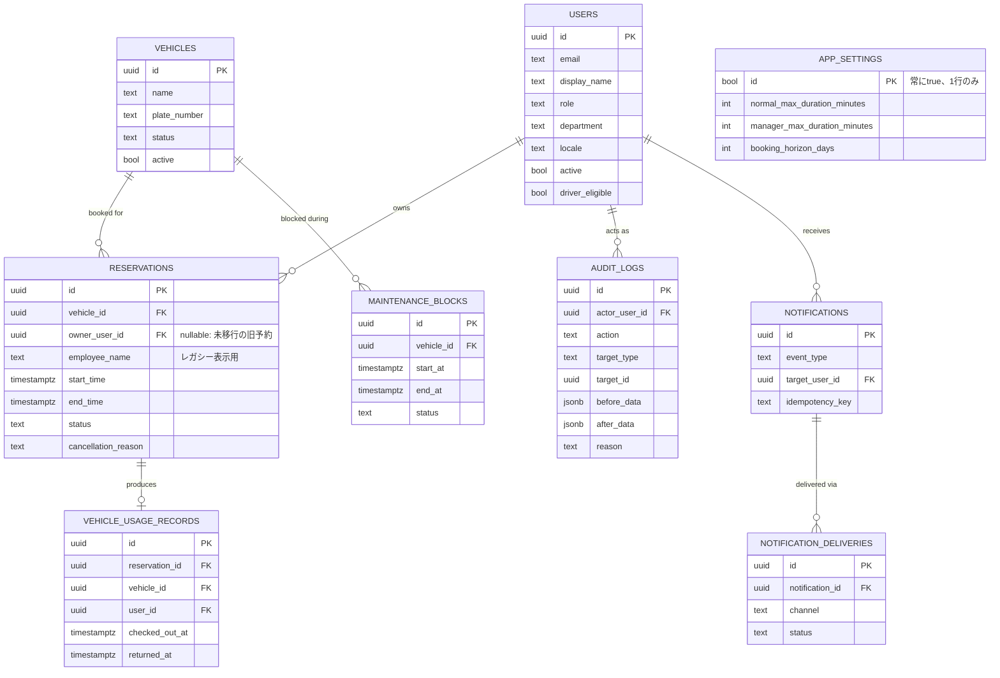

# 実装状況（IMPLEMENTATION_STATUS.md）

最終更新: 2026-07-13。このドキュメントは実際に確認できた範囲を正直に記載しています。
「動作した」ではなく「実装した」項目についても、テスト有無を明記しています。

---

## 1. データ構造（ER図）

`employees` テーブルは削除せずそのまま残しています（過去データ・旧フローの互換性維持のため）。

---

## 2. 完了した機能（コードは実装済み）

### フェーズ1: 認証・権限（2026-07-13に方針転換、詳細は下記「認証方式の変更」参照）
- 一般社員の個人ログインは廃止。予約は使用者名（`employee_name`）の自己申告（リスト選択）で識別
- 管理者ページ（`/admin`）のみ共有パスワード（`ADMIN_PASSWORD`/`ADMIN_SESSION_SECRET`、`src/lib/adminAuth.ts`/`src/lib/requireAdmin.ts`）で保護
- 各管理者専用API（車両・整備・社員名リスト編集）は `isAdminRequest()` で個別にガード（ミドルウェアなし、ページ/APIごとの直接チェック）
- 予約の変更・キャンセルは `requesterName` と `employee_name` の一致確認、または管理者権限で許可
- 出発・返却・延長・異常報告は誰でも実行可能（車両を物理操作する人が行う前提）
- 全ページ `noindex, nofollow`（`metadata.robots`で設定）

#### 認証方式の変更（2026-07-13）
2026-07-11に一度Supabase Auth（個人アカウント単位のログイン・招待制）へ全面移行したが、
本番運用開始直後に次の問題が連続して発生し、運用負荷が見合わないと判断して共有パスワード
方式に戻した:
- Vercel Hobbyプランではcronが1日1回までしか使えず、`vercel.json`の15分毎設定がデプロイ自体を
  静かにブロックし続けていた（UIにエラーが表示されず原因特定に時間を要した）
- 招待メールのリンク遷移先（Supabase の Site URL）がlocalhostのままで、本番で開けなかった
- Supabaseの組み込みメール送信（`noreply@mail.app.supabase.io`）のレート制限に繰り返し抵触し、
  管理者本人が一度もログインできない状態が続いた

`vehicles`/`maintenance_blocks`/`audit_logs`/`notifications`などのデータモデルや、予約・車両の
状態遷移（出発/返却/延長）、予約フォームUX、一覧フィルター、整備管理画面は**そのまま維持**し、
「個人ログインをやめる」部分だけを差し替えた。`public.users`テーブル・RLSポリシー・Supabase Auth
自体の設定はDBに残っているが、アプリからは参照していない（削除はしていない）。

### フェーズ2: データモデル
- `vehicles` / `vehicle_usage_records` / `maintenance_blocks` / `audit_logs` / `app_settings` テーブル追加
- `reservations` に `vehicle_id` / `owner_user_id` / `created_by_user_id` / `updated_by_user_id` / `status` / `cancellation_*` 列を追加（既存列は削除・変更なし）
- 既存予約への `vehicle_id` 一括バックフィル + 移行後の `NOT NULL` 化（既存データ保持を確認）
- Tier2スキーマ（`notifications` / `notification_deliveries` / `favorite_destinations` / `waitlist_entries` / `recurring_reservation_rules`）を追加（UIは未実装、下記参照）

### フェーズ3: 予約重複の完全防止
- `no_overlapping_reservations` 排他制約を `vehicle_id` + ステータス限定（`reserved`/`in_use`/`overdue`のみ）に更新
- `create_reservation_tx` / `update_reservation_tx` というPostgres関数（RPC）で、車両単位のアドバイザリーロック + 整備期間チェック + INSERT/UPDATEをアトミックに実行
- 冪等キー（`idempotency_key`列、一意制約）による二重送信防止のサーバー側基盤を追加

### フェーズ4: 予約・車両状態管理
- 予約ステータス: `reserved → in_use → completed` / `reserved → cancelled` / `reserved → no_show` / `in_use → overdue → completed`（`src/lib/reservationStatus.ts` で許可遷移を一元管理）
- 車両ステータス: `available` / `in_use` / `maintenance` / `out_of_service`
- 出発・返却・延長・異常報告API（`POST /api/reservations/[id]/action`）
- ホーム画面に車両の現在状態バナー（利用可能/使用中/整備中/利用停止中、次の予約、出発・返却・延長ボタン）

### フェーズ5: 履歴・監査
- 物理削除を廃止し、`DELETE`は内部的に「キャンセル」（status更新）として扱う
- 開始後の予約は本人（自己申告）が変更不可（管理者のみ、理由入力必須）
- `audit_logs` テーブル + 管理画面での閲覧UI（`AdminAuditLog`）
- 既存の `reservation_logs`（予約作成/変更/キャンセルの簡易履歴）はそのまま維持し、新しい `audit_logs`（出発/返却/延長/車両状態変更/ユーザー権限変更なども含む網羅的な監査ログ）を並行して追加

### フェーズ6-9（追加実装分）
- **予約フォームUX**: 開始時刻＋「利用時間」プルダウン（30分/1時間/2時間/3時間/4時間/その他）。終了予定時刻を自動計算・表示。「その他」選択時のみ終了日時を直接指定（管理者の長時間利用・レガシー予約の変則的な時間帯の編集に対応）
- **予約一覧のタブ・フィルター**: `/reservations`に「自分の予約/本日/今後の予約/使用中/過去の利用/キャンセル済み」の6タブ + ページネーション（30件単位）。初期表示は「自分の予約」
- **管理者の検索・絞り込み**: 予約一覧に検索ボックス（利用者名・行き先・用途・予約ID）+ ステータス絞り込み。取得件数を直近200件に制限（無制限取得を廃止）
- **整備管理画面**: `/admin`から整備・利用停止期間の登録・一覧・キャンセルが可能。既存予約と競合する場合は登録を拒否し、競合している予約を一覧表示（自動キャンセルはしない）

### 通知
- Microsoft Teams（社内利用サービス）向けIncoming Webhookプロバイダーを実装（`TEAMS_WEBHOOK_URL`未設定時は無効・開発用ログ出力のみ動作）。Slack例も同梱
- outbox方式（`notifications`/`notification_deliveries`）、Vercel Cronエンドポイント（`CRON_SECRET`で保護）
- 実際にoutboxへ書き込み済みのイベント: `reservation_created` / `reservation_updated` / `reservation_cancelled` / `extend_succeeded` / `extend_failed`
- 上記以外のイベント種別（利用前日リマインド、返却遅延、車検期限等）は型定義のみで、時間監視用のスケジュールジョブが必要なため未実装（下記参照）

### テスト
- Vitestによるユニットテスト27件（予約バリデーション・状態遷移）はすべて成功
- Playwrightの雛形 + スモークテスト（実行はローカルで確認済み。詳細は下記「テスト」参照）

---

## 3. 未実装・一部実装の機能（正直な報告）

以下は **実装していない、またはコードの型・スキーマのみでUI/API未実装** です。

| 項目 | 状態 |
| --- | --- |
| カレンダーの「今日」ボタン | **未実装** |
| 月変更後の週間表示が選択日と連動する仕様 | **未実装**（現状は常に「今週」を表示） |
| 車両詳細ページ（一般公開情報と管理者限定情報の出し分け） | **未実装**。`vehicles`テーブル・APIはあるが専用ページなし |
| 出発・返却時の詳細入力フォーム（走行距離・燃料残量・写真等） | **未実装**。APIは受け付けるが、専用UIフォームは未作成（ボタンのみ） |
| 写真アップロード（Supabase Storage） | **未実装** |
| 車検・保険等の期限に対する事前通知、返却遅延の自動検知 | **未実装**（時間経過を監視するスケジュールジョブが必要。`vehicles`の期限列自体は存在） |
| Teams通知の実配信検証 | **未実装**（`TEAMS_WEBHOOK_URL`未設定のため未検証。設定手順はREADME参照） |
| メール/LINE WORKS通知 | **未実装**（プロバイダー未作成。Teams/Slackの実装パターンを踏襲すれば追加は容易） |
| 繰り返し予約 | スキーマのみ（`recurring_reservation_rules`）。UI/API未実装 |
| キャンセル待ち | スキーマのみ（`waitlist_entries`）。UI/API未実装 |
| よく使う行き先（お気に入り） | スキーマのみ（`favorite_destinations`）。UI/API未実装 |
| CSV出力 | **未実装** |
| 利用集計・ダッシュボード | **未実装** |
| PWA化 | **未実装** |
| Google/Outlookカレンダー連携・ICS出力 | **未実装** |
| 「JP/VN」表示を「日本語 | Tiếng Việt」に変更 | **未実装**（既存の短縮表示のまま） |
| 自動アクセシビリティテスト | **未実装** |
| E2Eの予約フロー（作成・変更・キャンセル・出発・返却等）と管理者ログイン | **未実装**（雛形とスモークテストのみ用意） |

---

## 4. 外部認証情報待ちの機能

- **Microsoft Teams通知の実配信**: 社内で利用中のサービスとして決定済み。`src/lib/notifications/providers/teamsProvider.ts`を実装済みだが、実際のIncoming Webhook URL（`TEAMS_WEBHOOK_URL`）が無いため送信テストは未実施。TeamsチームがPower Automateフロー方式に移行済みの場合、ペイロード形式の調整が必要な可能性がある（コード内コメント参照）。
- **Vercel Cron**: `vercel.json`で1日1回（`0 0 * * *`）の設定を用意済み（HobbyプランはCronが1日1回までのため。より高頻度にするにはProプランへのアップグレード、または外部cronサービスからのHTTP呼び出しへの切り替えが必要）。`CRON_SECRET`の設定が必要。

---

## 5. 手動確認が必要な項目（このセッションでは未検証）

- 2ユーザーが同時に同じ時間帯を予約した際に、片方だけ成功しもう片方が409になること（実際の同時実行テストは未実施。DBの排他制約により理論上は保証される設計）。
- Teams/Slack通知の実配信（`TEAMS_WEBHOOK_URL`/`SLACK_WEBHOOK_URL`未設定のため未検証）。

---

## 6. 優先度（次にやるべきこと）

1. ~~本番Supabaseへのスキーマ適用~~ ✅ 完了（2026-07-13）
2. ~~予約フォームのUX改善~~ ✅ 完了
3. ~~予約一覧のフィルター・タブ~~ ✅ 完了
4. ~~整備管理画面~~ ✅ 完了
5. Teams通知の実配信検証（`TEAMS_WEBHOOK_URL`発行待ち）
6. E2Eテストの拡充（予約作成・変更・キャンセル・出発/返却・管理者ログインの一連のフロー）

---

## 7. 関連ファイル

- スキーマ: `supabase/schema.sql`
- 認証: `src/lib/adminAuth.ts`, `src/lib/requireAdmin.ts`, `src/app/api/admin/`
- 予約API: `src/app/api/reservations/`
- 状態遷移: `src/lib/reservationStatus.ts`
- 監査ログ: `src/lib/auditLog.ts`
- 通知: `src/lib/notifications/`
- テスト: `src/lib/*.test.ts`（Vitest）, `e2e/`（Playwright）
